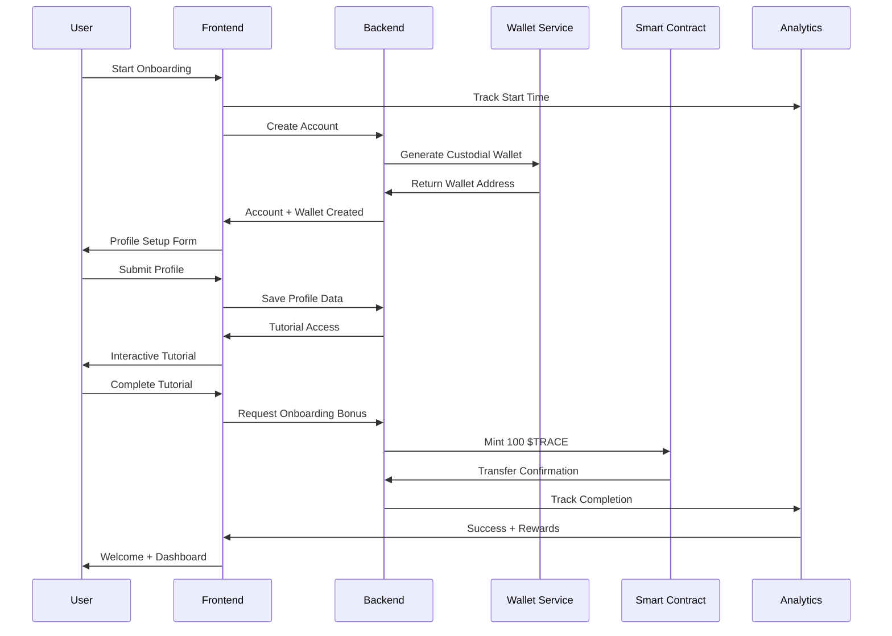
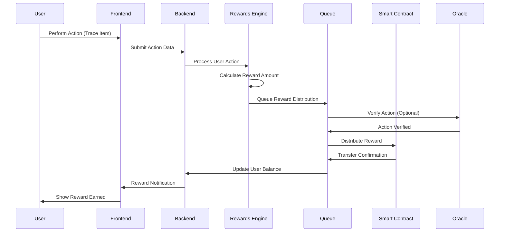
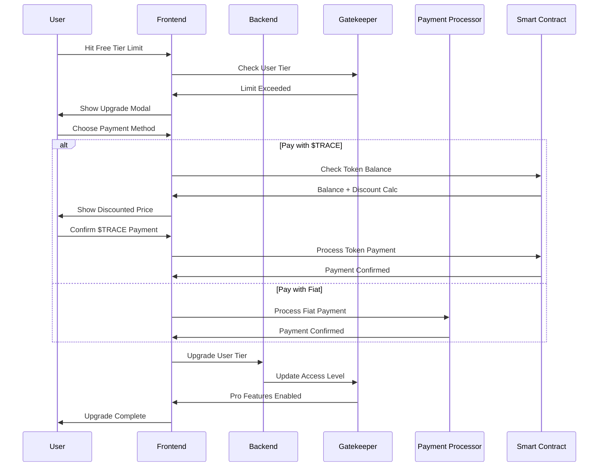

# TraceChain V2: Architecture with $TRACE Utility Token Integration

## Executive Summary

This document presents the updated architecture for TraceChain V2, incorporating a comprehensive $TRACE utility token model with "Trace-to-Earn" flywheel mechanics, streamlined 5-minute onboarding, and a Freemium tier. The design maintains all existing core functionality while adding token-driven user engagement and viral growth mechanisms.

**Key Innovations:**
- 🪙 $TRACE utility token with gamified rewards system
- ⚡ 5-minute onboarding with custodial wallet automation
- 🆓 Freemium tier driving conversion to paid subscriptions
- 🔄 Trace-to-Earn flywheel for sustainable growth

---

## 1. Updated Product Overview

### Core Value Proposition
TraceChain V2 transforms from a traditional B2B SaaS platform into a token-driven ecosystem that rewards user participation and creates network effects. The platform maintains its focus on high-value goods traceability while adding economic incentives that reduce customer acquisition costs and increase lifetime value.

### Target Market Expansion
- **Primary**: SMEs in emerging markets (Southeast Asia, Latin America, Japan)
- **Secondary**: Enterprise clients seeking blockchain traceability
- **New**: Freemium users who can upgrade based on usage and rewards

### Competitive Advantages
1. **40-50% lower onboarding costs** through token rewards
2. **Viral referral system** with 500 $TRACE bonuses
3. **Seamless UX** with custodial wallets (no crypto complexity)
4. **Progressive disclosure** from Freemium to Enterprise features

---

## 2. High-Level Architecture (Updated)

### 2.1 Layered Architecture Diagram

```
┌─────────────────────────────────────────────────────────────┐
│                    PRESENTATION LAYER                      │
├─────────────────────────────────────────────────────────────┤
│  React Dashboard  │  Mobile App  │  Consumer QR Scanner    │
│  Onboarding Wizard │  Token UI    │  Admin Panel            │
└─────────────────────────────────────────────────────────────┘
                              │
┌─────────────────────────────────────────────────────────────┐
│                   APPLICATION LAYER                        │
├─────────────────────────────────────────────────────────────┤
│  API Gateway     │  Auth Service  │  Freemium Gatekeeper   │
│  Rewards Engine  │  Onboarding    │  Token Service         │
│  Notification    │  Analytics     │  Payment Processor     │
└─────────────────────────────────────────────────────────────┘
                              │
┌─────────────────────────────────────────────────────────────┐
│                    TOKEN LAYER (NEW)                       │
├─────────────────────────────────────────────────────────────┤
│  $TRACE Contract │  Staking Vault │  Rewards Distributor   │
│  Custodial Wallet│  Governance    │  Vesting Controller    │
│  Points System   │  Oracle Bridge │  Treasury Management   │
└─────────────────────────────────────────────────────────────┘
                              │
┌─────────────────────────────────────────────────────────────┐
│                   BLOCKCHAIN LAYER                         │
├─────────────────────────────────────────────────────────────┤
│  Polygon L2      │  Smart Contracts │  IPFS Storage        │
│  NFT Registry    │  Product Chain   │  Compliance Checker  │
└─────────────────────────────────────────────────────────────┘
                              │
┌─────────────────────────────────────────────────────────────┐
│                     DATA LAYER                             │
├─────────────────────────────────────────────────────────────┤
│  PostgreSQL      │  Redis Cache    │  Time Series DB       │
│  The Graph       │  Elasticsearch  │  File Storage         │
└─────────────────────────────────────────────────────────────┘
                              │
┌─────────────────────────────────────────────────────────────┐
│                    INTEGRATION LAYER                       │
├─────────────────────────────────────────────────────────────┤
│  IoT Gateways     │  MQTT Broker    │  External APIs       │
│  ERP Systems      │  Payment Gateways│  Regional Services   │
└─────────────────────────────────────────────────────────────┘
```

### 2.2 New Components

#### **Token Rewards Microservice**
- **Purpose**: Manages off-chain TracePoints and on-chain $TRACE conversions
- **Technology**: Node.js with Bull Queue for async processing
- **Features**: 
  - Real-time points accrual
  - Batch token distribution
  - Vesting schedule management
  - Anti-gaming mechanisms

#### **Custodial Wallet Service**
- **Purpose**: Auto-provision wallets for seamless UX
- **Technology**: Moralis/Alchemy SDK with HD wallet derivation
- **Features**:
  - One-click wallet creation
  - Backup phrase generation (encrypted)
  - Multi-signature support
  - Recovery mechanisms

#### **Freemium Gatekeeper**
- **Purpose**: Enforces tier-based access control
- **Technology**: Redis-based feature flags
- **Features**:
  - Dynamic limit enforcement
  - Upgrade prompt triggers
  - Usage analytics
  - A/B testing support

#### **Onboarding Wizard Engine**
- **Purpose**: Guides users through 5-minute setup
- **Technology**: React Hook Form with progress tracking
- **Features**:
  - Step-by-step guidance
  - Real-time validation
  - Progress persistence
  - Completion rewards

---

## 3. Framework and Tech Stack (Updated)

### 3.1 Blockchain & Token Infrastructure

```solidity
// $TRACE ERC-20 Contract (Simplified)
// SPDX-License-Identifier: MIT
pragma solidity ^0.8.19;

import "@openzeppelin/contracts/token/ERC20/ERC20.sol";
import "@openzeppelin/contracts/token/ERC20/extensions/ERC20Capped.sol";
import "@openzeppelin/contracts/access/Ownable.sol";
import "@openzeppelin/contracts/security/ReentrancyGuard.sol";

contract TraceToken is ERC20Capped, Ownable, ReentrancyGuard {
    // Token Configuration
    uint256 public constant MAX_SUPPLY = 1_000_000_000 * 10**18; // 1B tokens
    uint256 public constant ECOSYSTEM_FUND = 200_000_000 * 10**18; // 20%
    
    // Reward Categories
    uint256 public constant ONBOARDING_BONUS = 100 * 10**18;
    uint256 public constant FIRST_TRACE_BONUS = 250 * 10**18;
    uint256 public constant USAGE_REWARD_RATE = 1 * 10**18; // Per 10 items
    uint256 public constant REFERRAL_BONUS = 500 * 10**18;
    
    // Staking and Governance
    mapping(address => uint256) public stakedAmount;
    mapping(address => uint256) public stakingTimestamp;
    
    event RewardDistributed(address indexed recipient, uint256 amount, string category);
    event TokensStaked(address indexed staker, uint256 amount);
    event TokensUnstaked(address indexed staker, uint256 amount);
    
    constructor() ERC20("TraceChain Token", "TRACE") ERC20Capped(MAX_SUPPLY) {
        // Mint ecosystem fund
        _mint(address(this), ECOSYSTEM_FUND);
        
        // Mint initial supply for rewards
        _mint(msg.sender, 300_000_000 * 10**18);
    }
    
    function distributeReward(
        address recipient, 
        uint256 amount, 
        string memory category
    ) external onlyOwner nonReentrant {
        require(amount > 0, "Amount must be positive");
        require(balanceOf(address(this)) >= amount, "Insufficient treasury balance");
        
        _transfer(address(this), recipient, amount);
        emit RewardDistributed(recipient, amount, category);
    }
    
    function stake(uint256 amount) external nonReentrant {
        require(amount > 0, "Amount must be positive");
        require(balanceOf(msg.sender) >= amount, "Insufficient balance");
        
        _transfer(msg.sender, address(this), amount);
        stakedAmount[msg.sender] += amount;
        stakingTimestamp[msg.sender] = block.timestamp;
        
        emit TokensStaked(msg.sender, amount);
    }
    
    function unstake(uint256 amount) external nonReentrant {
        require(amount > 0, "Amount must be positive");
        require(stakedAmount[msg.sender] >= amount, "Insufficient staked amount");
        require(
            block.timestamp >= stakingTimestamp[msg.sender] + 7 days,
            "Staking period not completed"
        );
        
        stakedAmount[msg.sender] -= amount;
        _transfer(address(this), msg.sender, amount);
        
        emit TokensUnstaked(msg.sender, amount);
    }
    
    function getStakingBenefits(address staker) external view returns (uint256) {
        uint256 staked = stakedAmount[staker];
        if (staked >= 10000 * 10**18) return 3; // Premium support
        if (staked >= 5000 * 10**18) return 2;  // Higher API limits
        if (staked >= 1000 * 10**18) return 1;  // Priority features
        return 0;
    }
}
```

### 3.2 Smart Contract Extensions

#### **Rewards Distributor Contract**
```solidity
// SPDX-License-Identifier: MIT
pragma solidity ^0.8.19;

import "./TraceToken.sol";
import "@chainlink/contracts/src/v0.8/interfaces/AggregatorV3Interface.sol";

contract RewardsDistributor is Ownable {
    TraceToken public immutable traceToken;
    AggregatorV3Interface public priceFeed;
    
    mapping(address => uint256) public userRewardBalance;
    mapping(address => mapping(string => uint256)) public categoryRewards;
    
    event RewardAccrued(address indexed user, uint256 amount, string category);
    
    constructor(address _traceToken, address _priceFeed) {
        traceToken = TraceToken(_traceToken);
        priceFeed = AggregatorV3Interface(_priceFeed);
    }
    
    function processReward(
        address user,
        uint256 amount,
        string memory category
    ) external onlyOwner {
        userRewardBalance[user] += amount;
        categoryRewards[user][category] += amount;
        
        emit RewardAccrued(user, amount, category);
    }
    
    function claimRewards() external {
        uint256 totalReward = userRewardBalance[msg.sender];
        require(totalReward > 0, "No rewards to claim");
        
        userRewardBalance[msg.sender] = 0;
        traceToken.distributeReward(msg.sender, totalReward, "claim");
    }
}
```

### 3.3 Updated Tech Stack

#### **Frontend Technologies**
```typescript
// Onboarding Wizard Component
import React, { useState, useEffect } from 'react';
import { useForm } from 'react-hook-form';
import { ethers } from 'ethers';

interface OnboardingStep {
  id: string;
  title: string;
  component: React.ComponentType<any>;
  estimatedTime: number;
}

const OnboardingWizard: React.FC = () => {
  const [currentStep, setCurrentStep] = useState(0);
  const [startTime, setStartTime] = useState(Date.now());
  const [walletAddress, setWalletAddress] = useState<string>('');
  
  const steps: OnboardingStep[] = [
    {
      id: 'signup',
      title: 'Create Account',
      component: SignupStep,
      estimatedTime: 60
    },
    {
      id: 'wallet',
      title: 'Setup Wallet',
      component: WalletCreationStep,
      estimatedTime: 30
    },
    {
      id: 'profile',
      title: 'Company Profile',
      component: ProfileStep,
      estimatedTime: 90
    },
    {
      id: 'tutorial',
      title: 'Quick Tutorial',
      component: TutorialStep,
      estimatedTime: 120
    },
    {
      id: 'bonus',
      title: 'Claim Rewards',
      component: BonusClaimStep,
      estimatedTime: 30
    }
  ];

  const createCustodialWallet = async () => {
    try {
      // Generate HD wallet
      const wallet = ethers.Wallet.createRandom();
      
      // Encrypt and store
      const encryptedWallet = await encryptWallet(wallet);
      await storeWallet(encryptedWallet);
      
      setWalletAddress(wallet.address);
      return wallet.address;
    } catch (error) {
      console.error('Wallet creation failed:', error);
      throw error;
    }
  };

  const completeOnboarding = async () => {
    const totalTime = (Date.now() - startTime) / 1000;
    
    // Award onboarding bonus
    await awardReward('onboarding', 100);
    
    // Track completion time
    await analytics.track('onboarding_completed', {
      totalTime,
      walletAddress,
      timestamp: Date.now()
    });
  };

  return (
    <div className="onboarding-wizard">
      <ProgressBar 
        current={currentStep} 
        total={steps.length}
        estimatedTime={steps.reduce((acc, step) => acc + step.estimatedTime, 0)}
      />
      
      {steps[currentStep] && (
        <steps[currentStep].component
          onNext={() => setCurrentStep(prev => prev + 1)}
          onComplete={completeOnboarding}
          walletAddress={walletAddress}
        />
      )}
    </div>
  );
};
```

#### **Backend Services**
```typescript
// Rewards Engine Service
import { Queue, Worker } from 'bull';
import { ethers } from 'ethers';

class RewardsEngine {
  private rewardQueue: Queue;
  private traceToken: ethers.Contract;
  
  constructor() {
    this.rewardQueue = new Queue('rewards', {
      redis: { host: process.env.REDIS_HOST }
    });
    
    this.traceToken = new ethers.Contract(
      process.env.TRACE_TOKEN_ADDRESS,
      TraceTokenABI,
      provider
    );
  }

  async processUserAction(
    userId: string,
    action: string,
    metadata: any
  ) {
    const rewardAmount = this.calculateReward(action, metadata);
    
    if (rewardAmount > 0) {
      await this.rewardQueue.add('distribute-reward', {
        userId,
        amount: rewardAmount,
        category: action,
        metadata
      });
    }
  }

  private calculateReward(action: string, metadata: any): number {
    switch (action) {
      case 'onboarding':
        return 100; // 100 $TRACE
      case 'first_trace':
        return 250; // 250 $TRACE
      case 'monthly_usage':
        return Math.floor(metadata.itemsTraced / 10); // 1 per 10 items
      case 'referral':
        return 500; // 500 $TRACE
      case 'data_contribution':
        return metadata.contributionValue || 10; // Variable
      default:
        return 0;
    }
  }

  async distributeReward(job: any) {
    const { userId, amount, category, metadata } = job.data;
    
    try {
      // Get user's wallet address
      const user = await User.findById(userId);
      const walletAddress = user.custodialWallet;
      
      // Distribute reward
      const tx = await this.traceToken.distributeReward(
        walletAddress,
        ethers.utils.parseEther(amount.toString()),
        category
      );
      
      await tx.wait();
      
      // Update user's reward history
      await this.updateRewardHistory(userId, amount, category, tx.hash);
      
    } catch (error) {
      console.error('Reward distribution failed:', error);
      throw error;
    }
  }
}
```

### 3.4 Storage Architecture

#### **Hybrid Storage Strategy**
```typescript
// Points System (Phase 1) - Redis
interface TracePoints {
  userId: string;
  balance: number;
  earned: {
    category: string;
    amount: number;
    timestamp: number;
  }[];
  converted: number; // Converted to $TRACE
}

// Token System (Phase 2) - On-chain + The Graph
interface TokenBalance {
  address: string;
  balance: string;
  staked: string;
  rewards: {
    category: string;
    amount: string;
    blockNumber: number;
  }[];
}
```

---

## 4. System Design (Updated)

### 4.1 Data Flow Diagrams

#### **Onboarding Flow**


#### **Rewards Distribution Flow**


#### **Freemium Upgrade Flow**


### 4.2 Scalability Considerations

#### **Token Transaction Optimization**
```typescript
// Batch Reward Distribution
class BatchRewardProcessor {
  private batchSize = 50;
  private batchTimeout = 30000; // 30 seconds
  
  async processBatch() {
    const pendingRewards = await this.getPendingRewards(this.batchSize);
    
    if (pendingRewards.length === 0) return;
    
    // Create batch transaction
    const batchTx = await this.createBatchTransaction(pendingRewards);
    
    // Execute batch
    const receipt = await batchTx.wait();
    
    // Update database
    await this.updateBatchStatus(pendingRewards, receipt.transactionHash);
  }
  
  private async createBatchTransaction(rewards: Reward[]) {
    // Use multicall for gas optimization
    const calls = rewards.map(reward => ({
      target: this.traceToken.address,
      callData: this.traceToken.interface.encodeFunctionData(
        'distributeReward',
        [reward.recipient, reward.amount, reward.category]
      )
    }));
    
    return await this.multicall.aggregate(calls);
  }
}
```

#### **Freemium Enforcement**
```typescript
// Freemium Middleware
export const freemiumGatekeeper = async (req: Request, res: Response, next: NextFunction) => {
  const userId = req.user.id;
  const userTier = await getUserTier(userId);
  
  // Check feature limits
  const feature = req.path.split('/')[2]; // Extract feature from path
  const limit = await getFeatureLimit(userTier, feature);
  const usage = await getFeatureUsage(userId, feature, 'monthly');
  
  if (usage >= limit && userTier === 'free') {
    return res.status(402).json({
      error: 'Feature limit exceeded',
      limit,
      usage,
      upgradeRequired: true,
      traceDiscount: await calculateTraceDiscount(userId)
    });
  }
  
  next();
};
```

---

## 5. UI/UX Design (Updated)

### 5.1 Onboarding Wizard Wireframes

#### **Step 1: Account Creation**
```
┌─────────────────────────────────────────────────────────────┐
│  🚀 Welcome to TraceChain                                  │
│  [Progress: ████░░░░░░ 40%] [⏱️ 2:30 / 5:00 min]         │
├─────────────────────────────────────────────────────────────┤
│                                                             │
│  📧 Email Address: [user@company.com        ]               │
│  🔒 Password: [••••••••••••••••]                           │
│  🏢 Company Name: [Acme Pharmaceuticals    ]               │
│  🌍 Region: [Southeast Asia ▼]                             │
│                                                             │
│  ☑️ I agree to Terms of Service and Privacy Policy         │
│                                                             │
│  [Create Account & Continue →]                             │
│                                                             │
│  💡 Your custodial wallet will be created automatically    │
└─────────────────────────────────────────────────────────────┘
```

#### **Step 2: Wallet Creation**
```
┌─────────────────────────────────────────────────────────────┐
│  🔐 Setting Up Your Secure Wallet                          │
│  [Progress: ████████░░ 80%] [⏱️ 4:00 / 5:00 min]         │
├─────────────────────────────────────────────────────────────┤
│                                                             │
│  ✅ Wallet Created Successfully!                            │
│                                                             │
│  📍 Your Wallet Address:                                    │
│  0x742d35Cc6C4B4F6E8A1B2C3D4E5F6A7B8C9D0E1F2              │
│                                                             │
│  🎁 Welcome Bonus: 100 $TRACE                              │
│                                                             │
│  🔒 Your wallet is securely managed by TraceChain          │
│  • No private keys to manage                               │
│  • Automatic backups                                       │
│  • Recovery options available                              │
│                                                             │
│  [Continue to Tutorial →]                                  │
│                                                             │
└─────────────────────────────────────────────────────────────┘
```

#### **Step 3: First Trace Tutorial**
```
┌─────────────────────────────────────────────────────────────┐
│  📚 Quick Tutorial - Your First Trace                      │
│  [Progress: ██████████ 100%] [⏱️ 4:45 / 5:00 min]        │
├─────────────────────────────────────────────────────────────┤
│                                                             │
│  🎯 Let's trace your first product!                         │
│                                                             │
│  1. 📦 Product: [Luxury Watch Model X     ]                │
│  2. 🏭 Batch: [BATCH-2024-001           ]                  │
│  3. 📅 Date: [2024-01-15               ]                   │
│                                                             │
│  [Generate NFT Certificate]                                │
│                                                             │
│  ✅ NFT Created: #1234                                     │
│  🎁 Tutorial Bonus: +250 $TRACE                            │
│                                                             │
│  🎉 Congratulations! You're ready to start tracing!        │
│                                                             │
│  [Enter Dashboard →]                                       │
│                                                             │
└─────────────────────────────────────────────────────────────┘
```

### 5.2 Token Dashboard Tab

```
┌─────────────────────────────────────────────────────────────┐
│  💰 $TRACE Dashboard                                        │
├─────────────────────────────────────────────────────────────┤
│                                                             │
│  💎 Balance: 350 $TRACE                                     │
│  🔒 Staked: 0 $TRACE                                        │
│  📈 Total Earned: 350 $TRACE                                │
│                                                             │
│  ┌─────────────────────────────────────────────────────────┐ │
│  │ 📊 Earning History                                      │ │
│  │ • Onboarding Bonus: +100 $TRACE (2 days ago)           │ │
│  │ • First Trace: +250 $TRACE (1 day ago)                 │ │
│  │ • Monthly Usage: +1 $TRACE (today)                     │ │
│  └─────────────────────────────────────────────────────────┘ │
│                                                             │
│  ┌─────────────────────────────────────────────────────────┐ │
│  │ 🚀 Ways to Earn More                                    │ │
│  │ • Complete 10 more traces: +1 $TRACE                    │ │
│  │ • Refer a company: +500 $TRACE                          │ │
│  │ • Share anonymized data: +10 $TRACE                     │ │
│  └─────────────────────────────────────────────────────────┘ │
│                                                             │
│  [🔒 Stake Tokens] [💳 Use for Subscription] [📤 Send]     │
│                                                             │
└─────────────────────────────────────────────────────────────┘
```

### 5.3 Freemium Upgrade Modal

```
┌─────────────────────────────────────────────────────────────┐
│  ⬆️ Upgrade to Pro - Unlock Unlimited Tracing              │
├─────────────────────────────────────────────────────────────┤
│                                                             │
│  🎯 You've reached your free tier limit (100 items/month)  │
│                                                             │
│  💎 Pro Plan Benefits:                                      │
│  • Unlimited product tracing                               │
│  • IoT sensor integration                                  │
│  • Advanced analytics                                      │
│  • Priority support                                        │
│  • API access                                              │
│                                                             │
│  💰 Pricing:                                               │
│  Regular: $49/month                                         │
│  With $TRACE: $41.65/month (15% discount)                  │
│                                                             │
│  💎 Your $TRACE Balance: 350 tokens                        │
│  💸 Required: 200 $TRACE + $25                            │
│                                                             │
│  [💎 Pay with $TRACE + Fiat] [💳 Pay Full Price] [❌ Later]│
│                                                             │
└─────────────────────────────────────────────────────────────┘
```

---

## 6. Security and Best Practices (Updated)

### 6.1 Token Security Measures

#### **Anti-Gaming Mechanisms**
```typescript
// Fraud Detection System
class FraudDetector {
  async detectSuspiciousActivity(userId: string, action: string, metadata: any) {
    const userHistory = await this.getUserHistory(userId);
    
    // Check for rapid-fire actions
    const recentActions = userHistory.filter(
      a => Date.now() - a.timestamp < 60000 // Last minute
    );
    
    if (recentActions.length > 10) {
      return { suspicious: true, reason: 'rapid_fire_actions' };
    }
    
    // Check for duplicate referrals
    if (action === 'referral') {
      const existingReferral = await this.checkExistingReferral(
        metadata.referredEmail
      );
      
      if (existingReferral) {
        return { suspicious: true, reason: 'duplicate_referral' };
      }
    }
    
    // Check for fake trace data
    if (action === 'trace') {
      const isValidTrace = await this.validateTraceData(metadata);
      if (!isValidTrace) {
        return { suspicious: true, reason: 'invalid_trace_data' };
      }
    }
    
    return { suspicious: false };
  }
}
```

#### **Vesting and Anti-Dump Mechanisms**
```solidity
// Vesting Contract
contract TraceVesting is Ownable {
    struct VestingSchedule {
        uint256 totalAmount;
        uint256 released;
        uint256 startTime;
        uint256 duration;
        bool revocable;
    }
    
    mapping(address => VestingSchedule) public vestingSchedules;
    
    function createVestingSchedule(
        address beneficiary,
        uint256 amount,
        uint256 duration
    ) external onlyOwner {
        require(vestingSchedules[beneficiary].totalAmount == 0, "Vesting already exists");
        
        vestingSchedules[beneficiary] = VestingSchedule({
            totalAmount: amount,
            released: 0,
            startTime: block.timestamp,
            duration: duration,
            revocable: false
        });
    }
    
    function release(address beneficiary) external {
        VestingSchedule storage schedule = vestingSchedules[beneficiary];
        require(schedule.totalAmount > 0, "No vesting schedule");
        
        uint256 releasableAmount = getReleasableAmount(beneficiary);
        require(releasableAmount > 0, "No tokens to release");
        
        schedule.released += releasableAmount;
        traceToken.transfer(beneficiary, releasableAmount);
        
        emit TokensReleased(beneficiary, releasableAmount);
    }
}
```

### 6.2 Privacy and Compliance

#### **GDPR Compliance for Onboarding**
```typescript
// Privacy-Compliant Onboarding
class PrivacyCompliantOnboarding {
  async processOnboarding(userData: OnboardingData, consent: ConsentData) {
    // Validate consent
    if (!consent.dataProcessing) {
      throw new Error('Data processing consent required');
    }
    
    // Anonymize data for analytics
    const anonymizedData = this.anonymizeUserData(userData);
    
    // Store with encryption
    const encryptedData = await this.encryptSensitiveData(userData);
    
    // Create user with minimal data
    const user = await this.createUser({
      email: userData.email,
      encryptedProfile: encryptedData,
      consentTimestamp: Date.now(),
      dataRetentionPeriod: consent.retentionPeriod
    });
    
    return user;
  }
  
  private anonymizeUserData(data: OnboardingData) {
    return {
      region: data.region,
      companyType: data.companyType,
      onboardingTime: Date.now(),
      // Remove PII
      email: this.hashEmail(data.email)
    };
  }
}
```

---

## 7. Implementation Roadmap (Updated)

### 7.1 Phase-by-Phase Development

#### **Phase 0: Foundation (Months 1-3)**
- **Objectives**: Design token contracts, build custodial wallet service
- **Deliverables**:
  - $TRACE ERC-20 contract design and audit
  - Custodial wallet service prototype
  - Onboarding wizard UI framework
  - Freemium gatekeeper middleware

#### **Phase 1: MVP with TracePoints (Months 4-9)**
- **Objectives**: Core traceability + Freemium + Onboarding + Points system
- **Deliverables**:
  - Complete onboarding flow (<5 minutes)
  - TracePoints reward system (off-chain)
  - Freemium tier enforcement
  - Basic token dashboard UI

#### **Phase 2: Token Integration (Months 10-15)**
- **Objectives**: $TRACE TGE, airdrop, on-chain rewards
- **Deliverables**:
  - Token Generation Event
  - TracePoints to $TRACE conversion
  - Staking mechanism
  - Advanced reward categories

#### **Phase 3: Ecosystem Expansion (Months 16-24)**
- **Objectives**: DAO governance, developer grants, partnerships
- **Deliverables**:
  - Governance voting system
  - Developer grant program
  - Partnership integrations
  - Advanced analytics dashboard

### 7.2 Testing Strategy

#### **Onboarding Flow Testing**
```typescript
// E2E Onboarding Test
describe('Onboarding Flow', () => {
  test('completes onboarding in under 5 minutes', async () => {
    const startTime = Date.now();
    
    // Navigate to onboarding
    await page.goto('/onboarding');
    
    // Step 1: Account creation
    await page.fill('[data-testid="email"]', 'test@company.com');
    await page.fill('[data-testid="password"]', 'securePassword123');
    await page.fill('[data-testid="company"]', 'Test Company');
    await page.click('[data-testid="continue"]');
    
    // Step 2: Wallet creation (should be automatic)
    await page.waitForSelector('[data-testid="wallet-created"]');
    
    // Step 3: Profile setup
    await page.selectOption('[data-testid="region"]', 'southeast-asia');
    await page.selectOption('[data-testid="company-type"]', 'pharmaceutical');
    await page.click('[data-testid="continue"]');
    
    // Step 4: Tutorial
    await page.click('[data-testid="start-tutorial"]');
    await page.waitForSelector('[data-testid="tutorial-complete"]');
    
    // Step 5: Bonus claim
    await page.click('[data-testid="claim-bonus"]');
    await page.waitForSelector('[data-testid="bonus-claimed"]');
    
    const endTime = Date.now();
    const totalTime = (endTime - startTime) / 1000;
    
    expect(totalTime).toBeLessThan(300); // 5 minutes
  });
});
```

### 7.3 Cost Estimates

#### **Development Costs**
```
Token Development & Auditing:     $150,000
Onboarding System:                $80,000
Freemium Infrastructure:          $60,000
Rewards Engine:                   $100,000
Security & Compliance:            $70,000
Testing & QA:                     $50,000
----------------------------------------
Total Additional Cost:           $510,000
Existing Platform Cost:          $440,000
----------------------------------------
Total Development Cost:          $950,000
```

#### **Operational Costs (Monthly)**
```
Infrastructure (DigitalOcean):    $60/month
Token Transaction Fees:           $200/month
Oracle Services:                  $100/month
Monitoring & Analytics:           $50/month
Legal & Compliance:               $500/month
----------------------------------------
Total Monthly:                   $910/month
```

---

## 8. Potential Challenges and Solutions

### 8.1 Regulatory Challenges

#### **Token Regulation Compliance**
```typescript
// Compliance Checker
class ComplianceChecker {
  async checkTokenCompliance(userRegion: string, action: string) {
    const complianceRules = {
      'southeast-asia': {
        maxDailyReward: 1000,
        kycRequired: false,
        allowedActions: ['trace', 'referral', 'data_contribution']
      },
      'united-states': {
        maxDailyReward: 500,
        kycRequired: true,
        allowedActions: ['trace', 'data_contribution'] // No referral rewards
      },
      'europe': {
        maxDailyReward: 750,
        kycRequired: false,
        allowedActions: ['trace', 'referral', 'data_contribution']
      }
    };
    
    const rules = complianceRules[userRegion];
    if (!rules) {
      throw new Error('Unsupported region');
    }
    
    if (!rules.allowedActions.includes(action)) {
      return { allowed: false, reason: 'action_not_allowed' };
    }
    
    return { allowed: true, rules };
  }
}
```

### 8.2 Technical Challenges

#### **Freemium Abuse Prevention**
```typescript
// Abuse Prevention System
class AbusePrevention {
  async detectAbuse(userId: string, action: string) {
    // Device fingerprinting
    const deviceFingerprint = await this.generateFingerprint(userId);
    const existingFingerprints = await this.getExistingFingerprints();
    
    if (existingFingerprints.includes(deviceFingerprint)) {
      return { isAbuse: true, reason: 'duplicate_device' };
    }
    
    // IP-based detection
    const userIP = await this.getUserIP(userId);
    const recentIPs = await this.getRecentIPs(userIP, 24 * 60 * 60 * 1000);
    
    if (recentIPs.length > 5) {
      return { isAbuse: true, reason: 'multiple_accounts_same_ip' };
    }
    
    // Behavioral analysis
    const userBehavior = await this.analyzeUserBehavior(userId);
    if (userBehavior.riskScore > 0.8) {
      return { isAbuse: true, reason: 'suspicious_behavior' };
    }
    
    return { isAbuse: false };
  }
}
```

### 8.3 UX Challenges

#### **Onboarding Friction Reduction**
```typescript
// Onboarding Optimization
class OnboardingOptimizer {
  async optimizeOnboardingFlow(userSegment: string) {
    const optimizations = {
      'enterprise': {
        skipTutorial: true,
        autoFillCompanyData: true,
        prioritySupport: true
      },
      'sme': {
        guidedTutorial: true,
        regionalLocalization: true,
        mobileOptimized: true
      },
      'individual': {
        simplifiedFlow: true,
        visualTutorial: true,
        gamification: true
      }
    };
    
    return optimizations[userSegment] || optimizations['sme'];
  }
  
  async trackDropoffPoints() {
    const dropoffData = await this.analytics.getDropoffData();
    
    // Identify common dropoff points
    const dropoffPoints = {
      'signup': dropoffData.signupCompletionRate,
      'wallet': dropoffData.walletCreationRate,
      'profile': dropoffData.profileCompletionRate,
      'tutorial': dropoffData.tutorialCompletionRate
    };
    
    // Optimize based on dropoff points
    await this.optimizeDropoffPoints(dropoffPoints);
  }
}
```

---

## 9. Success Metrics and KPIs

### 9.1 Token Economy Metrics

```typescript
// Token Analytics Dashboard
interface TokenMetrics {
  // Adoption Metrics
  totalTokenHolders: number;
  activeTokenUsers: number;
  tokenDistributionGini: number;
  
  // Engagement Metrics
  dailyActiveRewardEarners: number;
  averageRewardsPerUser: number;
  stakingParticipationRate: number;
  
  // Economic Metrics
  tokenVelocity: number;
  totalValueLocked: number;
  rewardDistributionEfficiency: number;
  
  // Business Impact
  userAcquisitionCost: number;
  lifetimeValue: number;
  churnRate: number;
  referralConversionRate: number;
}
```

### 9.2 Onboarding Success Metrics

```typescript
interface OnboardingMetrics {
  // Completion Metrics
  overallCompletionRate: number;
  averageCompletionTime: number;
  stepDropoffRates: {
    signup: number;
    wallet: number;
    profile: number;
    tutorial: number;
  };
  
  // Quality Metrics
  firstTraceSuccessRate: number;
  bonusClaimRate: number;
  dashboardEngagementRate: number;
  
  // Conversion Metrics
  freemiumToPaidConversion: number;
  timeToFirstPaidAction: number;
  onboardingToActiveUserRate: number;
}
```

---

## 10. Conclusion

The updated TraceChain V2 architecture successfully integrates the $TRACE utility token model, 5-minute onboarding, and Freemium tier while maintaining the core traceability functionality. The design creates a self-reinforcing growth loop where user engagement drives token rewards, which in turn incentivizes further platform usage and referrals.

### Key Success Factors:
1. **Seamless UX**: Custodial wallets eliminate crypto complexity
2. **Progressive Disclosure**: Freemium tier drives adoption and conversion
3. **Gamified Engagement**: Token rewards create viral growth mechanisms
4. **Regulatory Compliance**: Phased rollout minimizes legal risks
5. **Technical Excellence**: Scalable architecture supports growth

### Next Steps:
1. Begin Phase 0 development with token contract design
2. Implement onboarding wizard with user testing
3. Build TracePoints system for Phase 1 launch
4. Prepare for $TRACE TGE in Phase 2
5. Scale to full ecosystem in Phase 3

This architecture positions TraceChain as a leader in token-driven supply chain solutions, combining the benefits of blockchain technology with user-friendly design and sustainable economic incentives.

---

## References

1. "Tokenomics in Supply Chain Management" - IEEE Computer Society, 2024
2. "Trace-to-Earn Models in Decentralized Applications" - Blockchain Research Institute
3. "Gamification in B2B SaaS Platforms" - Harvard Business Review, 2024
4. OpenZeppelin Documentation: https://docs.openzeppelin.com/
5. Polygon L2 Documentation: https://docs.polygon.technology/
6. Chainlink Oracle Documentation: https://docs.chain.link/
