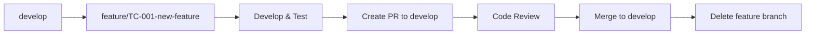
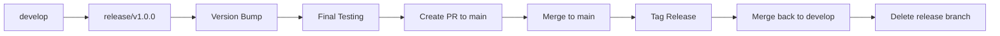
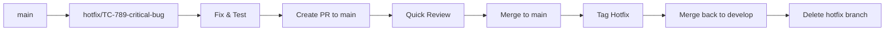

# TraceChain Web3-Dream - Branching Strategy

## 🎯 Overview

This document defines the branching strategy for the TraceChain decentralized traceability platform. We follow a **GitFlow-inspired** approach with modern DevOps practices, adapted for blockchain and web3 development.

## 🌳 Branch Structure

### **Primary Branches (Protected)**

#### 1. `main` (Production Branch)
- **Purpose**: Contains production-ready, stable code
- **Protection**: ✅ Protected, requires PR reviews
- **Deployment**: Auto-deploys to production
- **Merge Policy**: Only from `release/*` branches
- **Lifecycle**: Permanent

#### 2. `develop` (Integration Branch)
- **Purpose**: Integration branch for features
- **Protection**: ✅ Protected, requires PR reviews
- **Deployment**: Auto-deploys to staging
- **Merge Policy**: Only from `feature/*` and `hotfix/*` branches
- **Lifecycle**: Permanent

### **Supporting Branches**

#### 3. `feature/*` (Feature Development)
- **Naming**: `feature/JIRA-123-feature-name` or `feature/component-feature-name`
- **Purpose**: New features, enhancements
- **Source**: Always from `develop`
- **Target**: Always to `develop`
- **Lifecycle**: Deleted after merge
- **Examples**:
  - `feature/TC-001-jwt-authentication`
  - `feature/TC-002-smart-contract-integration`
  - `feature/TC-003-iot-mqtt-setup`

#### 4. `release/*` (Release Preparation)
- **Naming**: `release/v1.0.0` or `release/2025.1.0`
- **Purpose**: Prepare new production release
- **Source**: Always from `develop`
- **Target**: Both `develop` and `main`
- **Lifecycle**: Deleted after merge
- **Examples**:
  - `release/v1.0.0`
  - `release/v1.1.0`
  - `release/v2.0.0`

#### 5. `hotfix/*` (Production Fixes)
- **Naming**: `hotfix/JIRA-456-critical-bug` or `hotfix/security-patch`
- **Purpose**: Critical production fixes
- **Source**: Always from `main`
- **Target**: Both `main` and `develop`
- **Lifecycle**: Deleted after merge
- **Examples**:
  - `hotfix/TC-789-security-vulnerability`
  - `hotfix/TC-790-smart-contract-bug`

#### 6. `bugfix/*` (Bug Fixes)
- **Naming**: `bugfix/JIRA-123-bug-description`
- **Purpose**: Non-critical bug fixes
- **Source**: Always from `develop`
- **Target**: Always to `develop`
- **Lifecycle**: Deleted after merge

### **Specialized Branches**

#### 7. `smart-contracts/*` (Blockchain Development)
- **Naming**: `smart-contracts/contract-name-feature`
- **Purpose**: Smart contract development and testing
- **Source**: Always from `develop`
- **Target**: Always to `develop`
- **Examples**:
  - `smart-contracts/trace-token-upgrade`
  - `smart-contracts/nft-certificate-optimization`

#### 8. `infrastructure/*` (DevOps & Infrastructure)
- **Naming**: `infrastructure/component-change`
- **Purpose**: Infrastructure, deployment, monitoring changes
- **Source**: Always from `develop`
- **Target**: Always to `develop`
- **Examples**:
  - `infrastructure/docker-optimization`
  - `infrastructure/monitoring-setup`

#### 9. `experimental/*` (Research & POCs)
- **Naming**: `experimental/idea-name`
- **Purpose**: Proof of concepts, research, experiments
- **Source**: Always from `develop`
- **Target**: May or may not merge to `develop`
- **Lifecycle**: Long-lived, manually cleaned up

## 🔄 Workflow Processes

### **Feature Development Workflow**



#### Steps:
1. **Create Feature Branch**
   ```bash
   git checkout develop
   git pull origin develop
   git checkout -b feature/TC-001-jwt-authentication
   ```

2. **Develop & Test**
   ```bash
   # Make changes, commit frequently
   git add .
   git commit -m "feat: add JWT token generation"
   
   # Push regularly
   git push origin feature/TC-001-jwt-authentication
   ```

3. **Create Pull Request**
   - Target: `develop`
   - Include: Description, testing notes, screenshots
   - Request: At least 2 reviewers

4. **Code Review & Merge**
   - Address review feedback
   - Merge when approved
   - Delete feature branch

### **Release Workflow**



#### Steps:
1. **Create Release Branch**
   ```bash
   git checkout develop
   git checkout -b release/v1.0.0
   git push origin release/v1.0.0
   ```

2. **Prepare Release**
   - Update version numbers
   - Update CHANGELOG.md
   - Final testing and bug fixes
   - Update documentation

3. **Merge to Main**
   ```bash
   # Create PR to main
   # After merge, tag the release
   git tag -a v1.0.0 -m "Release version 1.0.0"
   git push origin v1.0.0
   ```

4. **Merge Back to Develop**
   ```bash
   git checkout develop
   git merge main
   git push origin develop
   ```

### **Hotfix Workflow**



#### Steps:
1. **Create Hotfix Branch**
   ```bash
   git checkout main
   git checkout -b hotfix/TC-789-security-patch
   ```

2. **Fix & Test**
   - Make minimal changes
   - Test thoroughly
   - Update version for hotfix

3. **Merge to Main**
   ```bash
   # Create PR to main (expedited review)
   # Tag hotfix version
   git tag -a v1.0.1 -m "Hotfix: security patch"
   ```

4. **Merge Back to Develop**
   ```bash
   git checkout develop
   git merge main
   git push origin develop
   ```

## 📋 Branch Protection Rules

### **Main Branch Protection**
- ✅ Require pull request reviews (2 reviewers minimum)
- ✅ Require status checks to pass
- ✅ Require branches to be up to date
- ✅ Restrict pushes to matching branches
- ✅ Allow force pushes: ❌
- ✅ Allow deletions: ❌

### **Develop Branch Protection**
- ✅ Require pull request reviews (1 reviewer minimum)
- ✅ Require status checks to pass
- ✅ Require branches to be up to date
- ✅ Restrict pushes to matching branches
- ✅ Allow force pushes: ❌

### **Required Status Checks**
- ✅ Build must pass
- ✅ Tests must pass
- ✅ Security scan must pass
- ✅ Code coverage must meet threshold (80%+)

## 🏷️ Tagging Strategy

### **Version Format**
- **Releases**: `v1.0.0`, `v1.1.0`, `v2.0.0`
- **Hotfixes**: `v1.0.1`, `v1.0.2`, `v1.1.1`
- **Pre-releases**: `v1.0.0-alpha.1`, `v1.0.0-beta.1`, `v1.0.0-rc.1`

### **Semantic Versioning**
- **MAJOR** (1.0.0): Breaking changes
- **MINOR** (0.1.0): New features, backward compatible
- **PATCH** (0.0.1): Bug fixes, backward compatible

## 🚀 Deployment Strategy

### **Environment Mapping**
- `main` → **Production** (production.tracechain.com)
- `develop` → **Staging** (staging.tracechain.com)
- `feature/*` → **Feature Environments** (feature-123.tracechain.com)
- `release/*` → **Release Testing** (release-v1.0.0.tracechain.com)

### **Smart Contract Deployment**
- **Testnet**: All feature branches
- **Staging**: Develop branch
- **Mainnet**: Main branch only (with manual approval)

## 📝 Commit Message Convention

We follow the **Conventional Commits** specification:

### **Format**
```
<type>[optional scope]: <description>

[optional body]

[optional footer(s)]
```

### **Types**
- `feat`: New feature
- `fix`: Bug fix
- `docs`: Documentation changes
- `style`: Code style changes (formatting, etc.)
- `refactor`: Code refactoring
- `test`: Adding or updating tests
- `chore`: Maintenance tasks
- `ci`: CI/CD changes
- `build`: Build system changes
- `perf`: Performance improvements

### **Examples**
```bash
feat(auth): implement JWT token generation
fix(contracts): resolve reentrancy vulnerability in ProductRegistry
docs(api): update authentication endpoints documentation
test(smart-contracts): add integration tests for TraceToken
chore(deps): update dependencies to latest versions
```

## 🔧 Branch Management Commands

### **Useful Git Aliases**
```bash
# Add to .gitconfig
[alias]
    co = checkout
    br = branch
    ci = commit
    st = status
    unstage = reset HEAD --
    last = log -1 HEAD
    visual = !gitk
    lg = log --oneline --graph --all
    cleanup = "!git branch --merged | grep -v '\\*\\|main\\|develop' | xargs -n 1 git branch -d"
```

### **Common Commands**
```bash
# Create and switch to feature branch
git checkout -b feature/TC-001-new-feature develop

# Update develop branch
git checkout develop && git pull origin develop

# Sync feature branch with develop
git checkout feature/TC-001-new-feature
git rebase develop

# Clean up merged branches
git branch --merged develop | grep -v 'develop\|main' | xargs git branch -d

# View branch hierarchy
git log --oneline --graph --all --decorate
```

## 🎯 Best Practices

### **Do's**
- ✅ Keep feature branches small and focused
- ✅ Commit frequently with meaningful messages
- ✅ Rebase feature branches before creating PRs
- ✅ Delete merged branches promptly
- ✅ Use descriptive branch names
- ✅ Test thoroughly before merging
- ✅ Keep main and develop branches stable

### **Don'ts**
- ❌ Never commit directly to main or develop
- ❌ Don't merge without code review
- ❌ Don't leave feature branches open for weeks
- ❌ Don't force push to shared branches
- ❌ Don't merge broken code
- ❌ Don't skip testing

## 📊 Branch Metrics & Monitoring

### **Key Metrics**
- **Feature Lead Time**: Time from branch creation to merge
- **Code Review Time**: Time from PR creation to approval
- **Bug Rate**: Bugs found in production vs development
- **Branch Cleanup**: Percentage of merged branches deleted

### **Automated Checks**
- Branch naming convention validation
- Commit message format validation
- Automatic branch deletion after merge
- PR template enforcement

## 🔄 Migration from Current State

Since we currently have all development on the `develop` branch, here's the migration plan:

### **Phase 1: Create Main Branch**
```bash
# Create main branch from current develop
git checkout develop
git checkout -b main
git push origin main

# Set main as default branch on GitHub
# Update branch protection rules
```

### **Phase 2: Establish Feature Workflow**
```bash
# Create first feature branch for next development
git checkout -b feature/TC-002-production-readiness develop
```

### **Phase 3: Set Up Automation**
- Configure GitHub Actions for CI/CD
- Set up branch protection rules
- Create PR templates
- Configure automated testing

This branching strategy ensures:
- **Code Quality**: Through mandatory reviews and testing
- **Release Stability**: Through proper release management
- **Team Collaboration**: Through clear workflows
- **Production Safety**: Through protected branches
- **Traceability**: Through proper tagging and documentation
